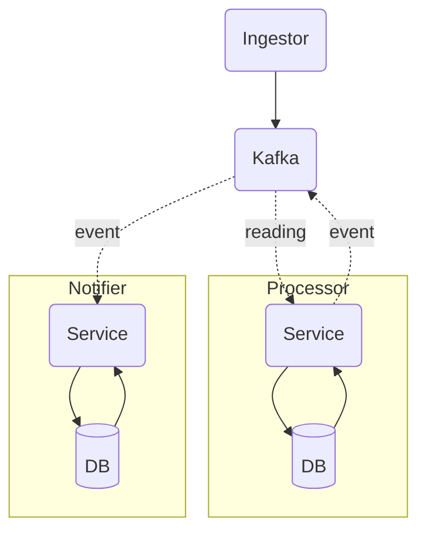

# Event Processing Project

The workflow starts when readings are submitted via HTTP to the *ingestor*. The ingestor then sends them to the *processor* through Kafka. Once the processor receives the data, it processes it, checks for anomalies, saves it in the database, and, when necessary, forwards it to the *notifier* via Kafka as well. The notifier is then responsible for delivering the notifications and storing them in its database.

This project is meant to help me deepen my understanding of **microservices** and how to build robust applications with **Go**. Apart from small college projects and videos explaining system design concepts, this is my first real experience with the language. In addition, while I am already familiar with the concept of dividing systems into separate services, the goal here is to develop those concepts further and explore new technologies to improve my knowledge.

## Architecture

The architecture uses **three services** to execute the workflow, along with a Kafka service that facilitates communication between them. The ingestor is responsible for receiving readings via HTTP and validating them before passing them to the processor. Kafka acts as the **main communication path** between services.

Kafka serves as a way to queue readings and organize the workflow so the application services can be scaled horizontally with greater ease. This service could potentially be replaced by RabbitMQ, but Kafka is a more widely adopted option and seems like a natural choice for this project.

After pushing the reading to the queue, the processor receives it, persists it in its database, validates whether the value changed or generated something new, and pushes an event to the **notification queue** when something relevant occurs.

The notifier then handles delivery and stores the notification using an **idempotency key** to avoid resending the same notification. It also handles retries, ensuring the notification is always sent and, if it cannot be delivered, storing it in a **dead-letter queue (DLQ)**.

## Technologies

This project does not rely on a large number of technologies, but the ones it uses are chosen thoughtfully to fit the problem. There is also some influence from market standards in these choices, since the main goal is to develop capabilities that align well with **real-world production systems**.

| Technologies | Where | Why |
| :--- | :--- | :--- |
| **Go** | Ingestor, Processor and Notifier | Go is commonly used in microservices and is a strong fit for this project, offering solid performance and a well-established ecosystem |
| **MongoDB** | Processor and Notifier | High availability and scalability, with flexibility to work with different data types and structures |
| **Kafka** | Communication between Ingestor, Processor and Notifier | Kafka is a well-established broker capable of handling large amounts of data, which suits the purpose of this application, especially if it needs to handle significant traffic |
| **Docker** | Deployment | Docker helps manage the different services in the system, making deployment and infrastructure setup much easier |
